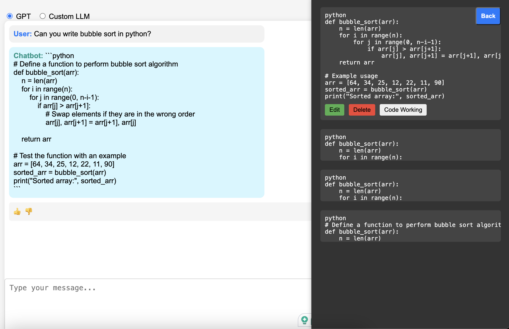

# Code Snippet Generator

## Introduction



This repository contains a code snippet generator that utilizes the OpenAI API and interacts with a PostgreSQL database. Follow the instructions below to set up and run the application locally.

Features that are part of this code generation repository are:
- Web Interface for Code Generation
- Feedback Loop for Improvement
- Custom LLM Integration (Llama2 Locally Deployment using Ollama)
- Containerization of Flask Web App and PostgreSQL DB
- Prompt Security
- Snippet Management
- Snippet Testing System Using Exec


## Getting Started

### Setting Up Environment Variables

1. Create an `.env` file in the root directory of the project.
2. Add the following configurations to the `.env` file:

    ```plaintext
    OPEN_AI_API=<Insert Your OpenAI API Key>
    DB_HOST="localhost"
    DB_PORT="5432"
    DB_USER="postgres"
    DB_PASSWORD="password"
    DB_DATABASE="code_snippet"
    ```

### Installing Ollama Library and Running Llama2 Locally

To install the Ollama library and run the Llama2 model locally, follow these steps:

1. Run the command below to download and install Ollama:

    ```bash
    curl -fsSL https://ollama.com/install.sh | sh
    ```

2. Once the installation is complete, run the Llama2 model using the command:

    ```bash
    ollama run llama2
    ```

3. Verify that the model is deployed by testing it using the API endpoint:

    ```bash
    curl http://localhost:11434/api/chat -d '{
      "model": "mistral",
      "messages": [
        { "role": "user", "content": "why is the sky blue?" }
      ]
    }'
    ```

## Docker Commands

### Running PostgreSQL Container

To run a PostgreSQL container to connect to the database, execute the following commands:

      ```bash
      sudo docker build -t my-postgres-image -f Dockerfile_postgres .
      sudo docker run -d --name my-postgres-container --restart always -p 5432:5432 -v postgres:/var/lib/postgresql/data my-postgres-image
      ```

## Running Code Snippet Container
To run the code snippet container, use the following commands:

      ```bash
      sudo docker build -t code-snippet -f Dockerfile_code .
      sudo docker run -d -p 5001:5001 code-snippet
      ```

## Running the Application
To run the application:

1. Install the required dependencies using:
      ```bash
      pip install -r requirements.txt
      ```
2. Start the application by running:
      ```bash
      python main.py
      ```
3. Visit http://localhost:5001/ in your web browser.
4. The application will start running. Select "GPT" to use the GPT model or "Custom LLM" to use a custom model.